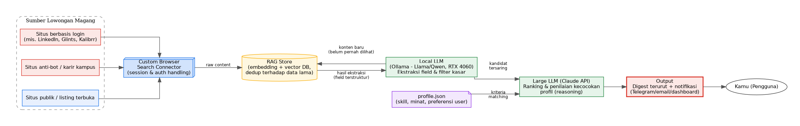
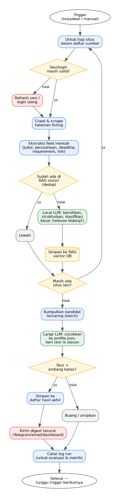

# Magang Finder

Pipeline pencarian lowongan magang otomatis: menjangkau job board yang tidak
ramah pencarian biasa, menyaring dengan LLM lokal, menilai kecocokan dengan
Claude, lalu mengirim digest terurut ke Telegram setiap pagi.



## Kenapa hybrid (LLM lokal + LLM besar)

Satu run bisa menyentuh ratusan halaman lowongan, dan sebagian besar tidak relevan
(pajak, HR, sales). Mengirim semuanya ke model besar itu mahal dan tidak perlu.

| Tahap | Dikerjakan oleh | Alasan |
|---|---|---|
| Dedup URL | SQLite | Gratis. Dilakukan **sebelum** halaman detail diambil |
| Ekstraksi field + filter kasar | Qwen2.5 7B (Ollama, RTX 4060) | Volume tinggi, tugasnya sederhana |
| Dedup lintas situs | sidik jari judul+perusahaan, lalu bge-m3 + ChromaDB | Lowongan yang sama sering dipasang di beberapa board |
| Ranking terhadap profil | Claude (`claude-opus-5`) | Butuh penalaran halus; hanya menerima kandidat yang sudah tersaring |

Setiap skor dari Claude **wajib disertai alasan**. Rekomendasinya bisa diaudit,
tidak sekadar berupa angka.

## Alur



1. Tiap sumber aktif: ambil halaman daftar → panen tautan detail.
2. Tautan yang sudah dikenal dilewati (dedup termurah).
3. Halaman detail → LLM lokal → field terstruktur (skema JSON dipaksakan lewat
   `format` Ollama) + keputusan relevan/tidak.
4. Dedup lintas situs, simpan ke SQLite + ChromaDB.
5. Kandidat relevan yang belum pernah dinilai **dengan profil saat ini** → Claude,
   per batch 8, dengan instruksi+profil sebagai prefix yang di-cache.
6. Skor ≥ ambang → digest Telegram. Semua run dicatat untuk metrik.

## Performa

Diukur dengan `scripts/benchmark.py` (biaya per komponen) dan run Glints terhadap
database kosong (`MF_DATA_DIR`), RTX 4060 8 GB:

| Per lowongan | Waktu | Catatan |
|---|---|---|
| Ambil halaman detail | ~9 s | proses + Chrome baru per halaman |
| Ekstraksi Qwen 7B | ~8,5 s | ~250 token keluaran @ 43 tok/s |
| Jeda sopan | 4 s | per situs |
| Embedding bge-m3 | ~2 s | |

Dua optimasi:

1. **Saring judul sebelum membuka detail** — Qwen menilai judul ambigu dalam satu
   batch; judul berkata IT (*engineer, data, UI/UX*, …) selalu dibuka. Dievaluasi
   terhadap 129 lowongan berlabel (`scripts/eval_saring_judul.py`): 55% halaman
   tidak perlu dibuka, 0 magang IT yang dinilai Claude ≥ 12 ikut terbuang.
2. **Antrean latar belakang** — halaman berikutnya diambil selagi Qwen memproses
   yang sekarang; berselang-seling antar situs agar jeda sopan tidak ditunggu kosong.
   Pengambilan tetap serial: connector memakai satu profil Chrome.

3. **Satu Chrome untuk seluruh run** — mode baru connector `sr.py layani` (permintaan
   JSON lewat stdin) menjaga browser tetap terbuka; halaman detail dibaca begitu
   elemen lowongannya muncul, tanpa menunggu jaringan sepi (skrip analytics membuat
   penantian itu selalu habis 5 detik). Pengaman akun tetap memeriksa setiap URL.

| Run Glints (DB kosong) | Awal | + saring judul & antrean | + satu Chrome |
|---|---|---|---|
| Waktu | 1030 s | 511 s | 388 s |
| Ambil 1 halaman detail | ~9 s | ~9 s | ~1 s (isi identik) |
| Waktu per lowongan | ~24 s | ~12,6 s | ~11,5 s (kini dibatasi Qwen) |
| Magang IT relevan | 8 | 12 | 12 |
| Relevan per menit | 0,47 | 1,41 | 1,86 |

## Deep Search

Di halaman detail lowongan, **Deep Search** meriset perusahaannya: Claude (Claude
Code headless, hanya diberi alat `WebSearch` + `WebFetch`) menelusuri situs resmi,
LinkedIn, job board, berita, ulasan karyawan, dan laporan penipuan, lalu menyusun
profil + skor kredibilitas. Setiap fakta menunjuk nomor sumbernya; yang tidak
ditemukan tidak dicantumkan. Hasil disimpan per perusahaan (`riset_perusahaan`),
jadi semua lowongan dari PT yang sama memakai satu riset.

```bash
.venv\Scripts\python mf.py riset 137      # juga bisa dari CLI
```

Setelah riset selesai, semua lowongan perusahaan itu **dinilai ulang otomatis**:
skor kredibilitas masuk ke prompt ranking sebagai bukti (kredibilitas rendah →
red flag + skor maksimal 40; data tidak cukup → red flag "tidak terverifikasi").

## Tanya Claude

Setiap lowongan punya panel chat. Claude menerima konteks lowongan, penilaian,
profil, dan laporan Deep Search; pertanyaan di luar itu dijawab dengan pencarian
web (hanya `WebSearch`/`WebFetch`). Jawaban dialirkan lewat Server-Sent Events —
teks muncul kata per kata dan setiap pencarian web ditampilkan saat terjadi.
Riwayat tersimpan per lowongan (`chat_pesan`); pertanyaan yang gagal dijawab
dibuang supaya bisa diulang bersih.

## Sumber

Daftar lengkap dan statusnya ada di [config/sumber_situs.yaml](config/sumber_situs.yaml).

| Jalur | Sumber |
|---|---|
| Connector browser (sesi login, anti-bot) | JobStreet, Glints, Karirhub (Kemnaker), Loker.id, KitaLulus |
| API publik situs (tanpa key, tanpa browser) | Dealls, Kalibrr, Tech in Asia |
| API resmi (butuh key) | Jooble (key dari id.jooble.org; isi detail lewat connector), Adzuna, Careerjet |
| Nonaktif (alasan dicatat di config) | Karir.com, TopKarir, Urbanhire, LinkedIn |

Halaman diambil lewat *custom browser search connector* terpisah
(`C:\Tools\AI\Search\sr.py`), yang memegang Playwright, sesi login, dan pengaman
akun. Proyek ini memanggilnya sebagai subprocess dan hanya membaca markdown
yang dihasilkannya.

## Menjalankan

```bash
python -m venv .venv
.venv\Scripts\pip install -r requirements.txt
copy .env.example .env                       # isi key
copy config\profile_contoh.json config\profile.json   # sesuaikan

.venv\Scripts\python mf.py uji-sumber glints --detail   # cek satu adapter
.venv\Scripts\python mf.py run                          # satu run penuh
.venv\Scripts\python mf.py daftar --min-skor 60 --url
.venv\Scripts\python mf.py tandai 42 dilamar
.venv\Scripts\python mf.py cari "backend python remote"
.venv\Scripts\python mf.py statistik
powershell -File scripts\jadwalkan.ps1 -Jam 07:00       # run harian
```

Prasyarat: Ollama dengan `qwen2.5:7b-instruct-q4_K_M` dan `bge-m3`.

## Deploy: mesin lokal + showcase publik

Semua komputasi (Qwen di GPU, Chrome connector, Claude Code) tetap di mesin lokal.
Yang online hanya tampilannya:

```
mesin lokal ── mf.py showcase ──▶ branch showcase-data (GitHub) ──▶ situs showcase (Vercel, baca-saja)
     ▲
     └── panel kontrol: http://<IP-komputer>:3000 — hanya dari WiFi yang sama, wajib login Google
```

- **Showcase** (`api/showcase.py`): setelah run atau Deep Search selesai, data yang boleh
  publik (lowongan, skor, alasan, profil perusahaan, laporan riset, statistik) diekspor ke
  `snapshot.json` lalu di-push. Catatan, status lamaran, chat, profil, dan pengaturan tidak ikut.
  Nyalakan di `settings.yaml` → `showcase.aktif`. Manual: `python mf.py showcase` (`--lihat`
  untuk ringkasan isi, `--ekspor FILE` untuk pratinjau).
- **Panel kontrol** (`api/auth.py`): `python scripts/api_dev.py --lan` mendengarkan di semua
  antarmuka, tapi klien di luar jaringan lokal ditolak dan setiap endpoint (selain `/health`,
  `/auth/*`) mewajibkan token sesi. Login Google terjadi di situs showcase, yang mengirim
  tiket HMAC sekali pakai kembali ke panel (`MF_JEMBATAN_SECRET`, `MF_EMAIL_IZIN` di `.env`).
  Selama keduanya kosong, panel hanya terbuka dari komputer ini sendiri.

### Menyalakan panel sesuai kebutuhan

Panel tidak menyala otomatis saat Windows hidup. Klik dua kali `Mulai Panel.cmd` untuk
menyalakan API + web di latar (browser terbuka sendiri) dan `Hentikan Panel.cmd` untuk
mematikannya. Di baliknya: `scripts/panel.ps1 mulai|berhenti|status`. Web hanya dibangun
ulang kalau kodenya berubah. Run yang sedang berjalan tidak ikut dimatikan.

### Keamanan panel kontrol

Diuji dengan serangan nyata terhadap layanan yang berjalan (lihat `tests/test_auth.py`):

| Lapisan | Perlindungan |
|---|---|
| Jaringan | Hanya klien IP lokal/privat; `X-Forwarded-For` tidak dipercaya (`proxy_headers=False`) |
| DNS rebinding | Header `Host` wajib localhost/IP privat — domain penyerang yang diarahkan ke IP ini ditolak |
| Login | Token HMAC-SHA256 (tiket 2 menit sekali pakai → sesi 30 hari), perbandingan waktu-konstan, email daftar izin |
| Pencabutan | `python mf.py cabut-sesi` (atau `POST /auth/cabut-semua`) mengeluarkan semua perangkat |
| Jembatan login | Alamat kembali hanya panel sendiri (`MF_PANEL_ASAL` di Vercel), state OAuth di cookie `HttpOnly; Secure` |
| Claude | Ranking tanpa alat sama sekali; Deep Search & chat hanya WebSearch/WebFetch. Semua memakai `--strict-mcp-config --disable-slash-commands` (tanpa MCP, skill, file, shell), plus aturan anti prompt-injection |
| Frontend | Tautan dari data luar hanya http/https; `X-Frame-Options: DENY`, `nosniff`, `Referrer-Policy: no-referrer`; panel dijalankan dalam mode produksi (tanpa endpoint developer) |

Sisa risiko yang diterima: lalu lintas panel di WiFi rumah memakai HTTP biasa (bukan HTTPS),
dan aturan anti prompt-injection mengurangi tetapi tidak menjamin Claude mengabaikan instruksi
tersembunyi di halaman lowongan — konteks yang dibawanya tidak memuat kredensial apa pun.

## Struktur

```
mf.py                  CLI
config/                settings.yaml, sumber_situs.yaml, profile.json (gitignored)
pipeline/
  sumber/connector.py  adapter job board lewat connector
  sumber/api.py        adapter Jooble / Adzuna / Careerjet / Dealls / Kalibrr / Tech in Asia
  local_extract.py     Ollama: ekstraksi + filter kasar
  rank.py              Claude: skor + alasan
  run.py               orkestrator
  db.py                SQLite: lowongan, penilaian, runs
rag/store.py           embedding bge-m3 + ChromaDB, dedup semantik
notifier/telegram_bot.py
scripts/               penjadwal Windows Task Scheduler
docs/                  rencana proyek & diagram
```

## Etika & batasan

- Frekuensi rendah (satu run per hari, jeda antar halaman) dan hanya membaca
  halaman publik atau halaman milik akun sendiri.
- LinkedIn dinonaktifkan secara default karena ToS-nya melarang scraping.
- Isi halaman diperlakukan sebagai data: kedua prompt LLM secara eksplisit
  mengabaikan instruksi yang tertanam di teks lowongan.
